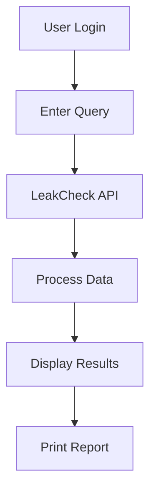

# 🔍 OSINT Tool

> **Find leaked data. Stay secure.**

A powerful **Flask-based OSINT (Open Source Intelligence) tool** that helps you detect leaked credentials (email, username, phone) using the LeakCheck API.

---

# 🚀 Features

✅ Search leaked data using email / username / phone
✅ Clean hacker-style UI (Neon theme)
✅ Secure login system
✅ Printable leak reports
✅ Dynamic result cards

---

# 🖼️ Project Preview

## 🔐 Login Page


## 🔎 Search Interface


## 📊 Leak Results


---

# 🧠 How It Works



---

# 🛠️ Tech Stack

* **Backend:** Flask (Python)
* **Frontend:** HTML, Bootstrap
* **API:** LeakCheck API
* **Templating:** Jinja2

---

# 📂 Project Structure

```
osint-flask-tool/
│── app.py
│── requirements.txt
│── static/
│    └── logo.jpg
│── README.md
```

---

# ⚙️ Setup & Installation

## 1️⃣ Clone Repository

```
git clone https://github.com/your-username/osint-flask-tool.git
cd osint-flask-tool
```

## 2️⃣ Install Dependencies

```
pip install -r requirements.txt
```

## 3️⃣ Add Environment Variable

Create a `.env` file:

```
API_KEY=your_api_key_here
```

## 4️⃣ Run Application

```
python app.py
```

👉 Open in browser:

```
http://127.0.0.1:5000
```

---

# 🔐 Security Improvements

* API key stored in `.env`
* Session-based authentication
* Error handling implemented

---

# ⚠️ Disclaimer

This tool is for **educational and security research purposes only**.
Do not misuse it for illegal activities.

---

# 👨‍💻 Author

**Aniket Das**

---

# ⭐ Support

If you like this project:

⭐ Star this repository
🍴 Fork and improve it
📢 Share with others
